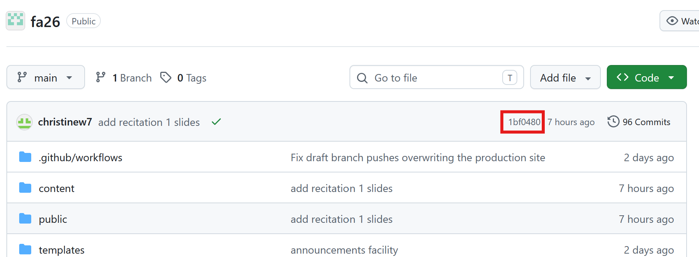
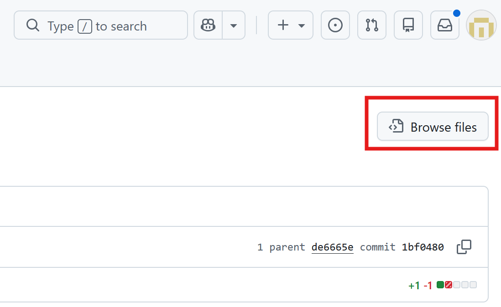
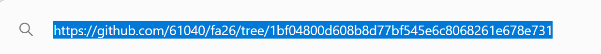

Your commit URL tells us which repository and exact version of your work to grade.

## 1. Open your commit

On your repository's main page, check that you are on the branch you want to submit. Click the short hash beside your latest commit.

<figure class="guide-step">
  
  <figcaption>Click the short hash next to your latest commit.</figcaption>
</figure>

## 2. View the committed files

On the commit page, click **Browse files**. This opens the repository exactly as it was at that commit.

<figure class="guide-step guide-step--compact">
  
  <figcaption>Choose <strong>Browse files</strong>.</figcaption>
</figure>

## 3. Copy and submit the full URL

Copy the entire URL from your browser's address bar. Paste it into the assignment submission form.

<figure class="guide-step guide-step--compact">
  
  <figcaption>Copy and submit the full URL, including the commit hash at the end.</figcaption>
</figure>
