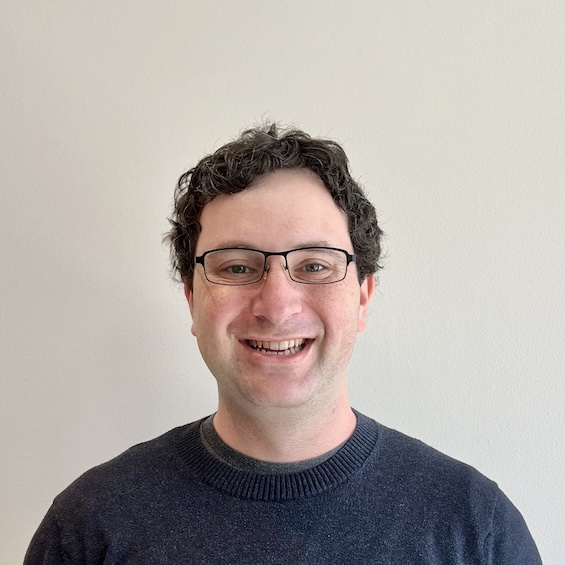
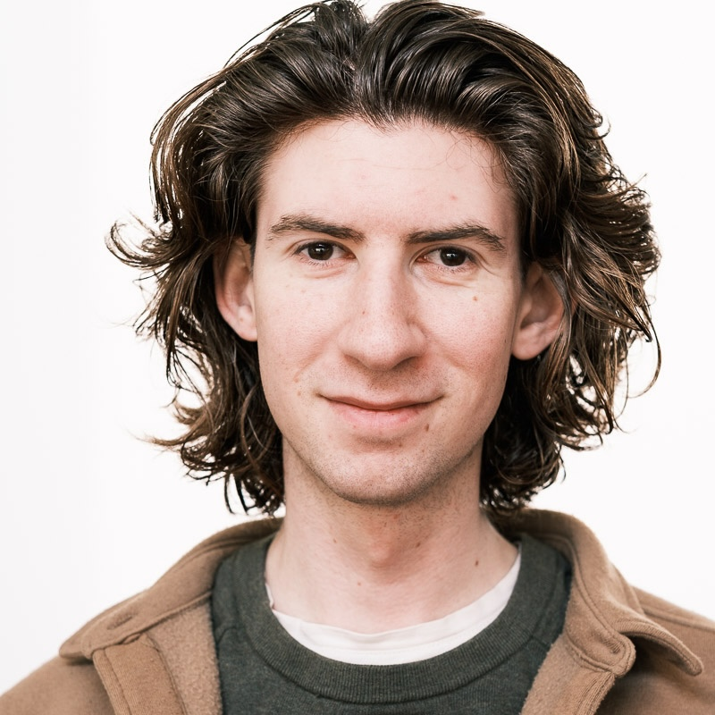
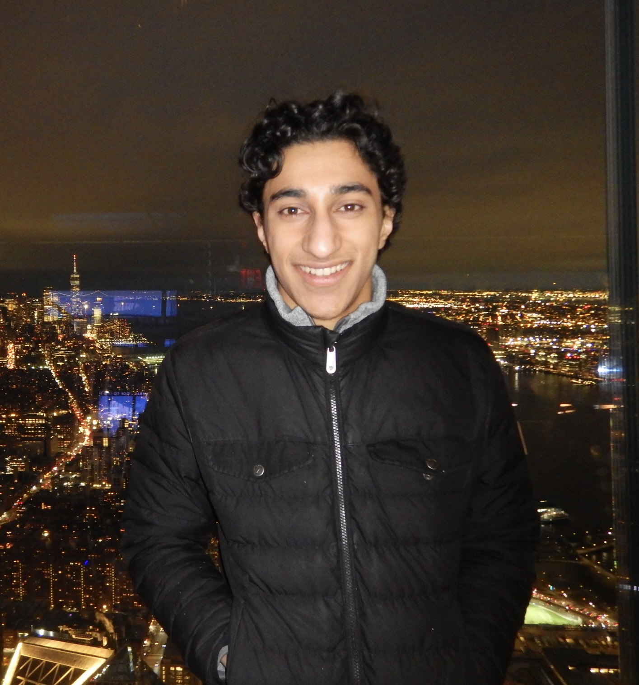
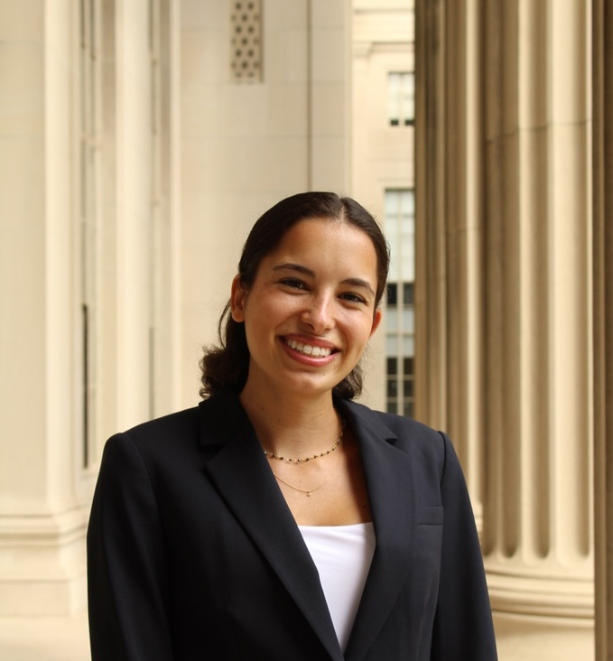

## Lecturers

**[Mitchell Gordon](https://mitchellg.github.io/)**

I’m excited to be teaching 6.1040 for the second time! With AI, we can build things in hours that would recently have taken weeks or months. Thus, there's never been a more interesting or important time to think about how to *design software well*.

My research bridges human-computer interaction and AI, particularly focused on alignment and safety problems. Come talk to me if that sounds interesting to you!

 

**[Daniel Jackson](https://people.csail.mit.edu/dnj/)**

I'm very excited to be teaching 6.1040 again this term. I'm especially excited
about the new AI components in the class. I love interacting with students,
especially talking about design, so don't be shy! When I'm not working on my
research in software design or my teaching, I like to do [photography](https://dnj.photo/).

## Teaching Staff

**Eagon Meng** (Graduate TA)

I'm a PhD student working with Daniel to make software simpler. Usually, you'll
find me either in a [hammock](https://www.youtube.com/watch?v=f84n5oFoZBc) or
yelling at the clouds about the self-inflicted headache we call technology. I
enjoy thinking about how to sneak human-first agendas into everything, and my
path has taken me from helping surgeons listen to the brain during surgery (on
an actual speaker), to [interactive art in Japan](https://www.teamlab.art/). Do
drop by - I'd love to meet you!

 

**[Carmel Schare](https://schare.space/)** (Graduate TA)

I'm a PhD student in the Software Design Group working on malleable software
and philosophy of technology.  I am interested in software governance and
social-civic infrastructure.  I have previously worked on quantum physics,
[digital humanities](https://www.makingandknowing.org/), programming languages, no-code development, and
[decentralized protocols](https://social.wiki/).  My goal is to help Eagon destroy all software.

Outside of the lab I am likely to be writing, cycling,
[sailing](https://sailing.mit.edu/), wandering around Camberville,
or talking about Ursula K. Le Guin.
I am very excited to help teach this course!

 

**[Kartik Pingle](https://www.linkedin.com/in/kartik-a-pingle/)** (Graduate TA)

I'm a first-year M.Eng. student in the Systems Architecture and Infrastructure Lab at CSAIL, working on the integration of ML and computer systems. I completed my undergrad here at MIT earlier this year in Courses 8 & 6-3. 

Outside of MIT, I love midday coffee runs, Lego sets with my roommates, and everything Star Wars. My family lives super close by, so you might catch me walking my dog down Mem Drive from time to time!

 

**Christine Wu** (Undergraduate TA)

senior majoring in 6-3

 

**[Amalia Toutziaridi](https://www.linkedin.com/in/amalia-toutziaridi/)** (Undergraduate TA)

I’m a senior majoring in 6-3 and minoring in 15-1. I took 6.104 in Fall 2025 and loved how much freedom the class gives you to be creative and build something you genuinely care about.

I’m interested in computational sustainability and have previously worked at the intersection of AI and education, including getting the chance to teach at a local charter high school in Cambridge! Throughout my undergrad, I’ve also been UROPing at [MIx](https://mix.mit.edu), where I’m currently working on an ensemble deep learning model for [early wildfire detection](https://picogrid.com/newsroom/picogrid-and-mit-mix-win-1-75m-program-to-help-first-responders-put-an-eye-on-wildfires) in collaboration with the U.S. Space Force.

Outside of school, I’m on the MIT Track & Field team, love baking, and am originally from Greece. I’m looking forward to a fun semester and seeing what everyone builds :)

