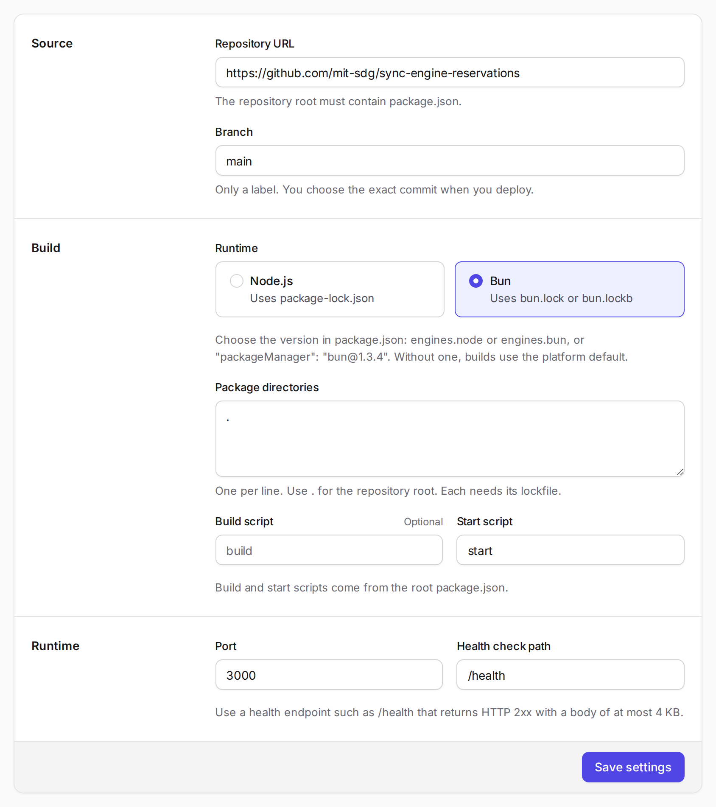
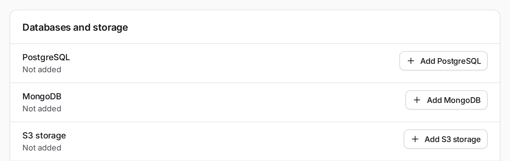
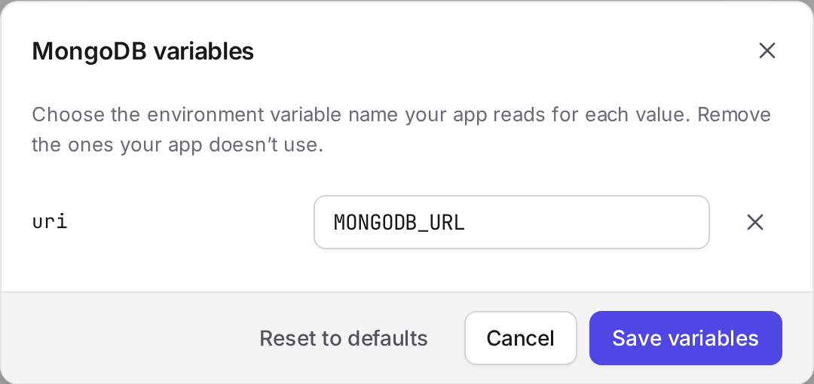
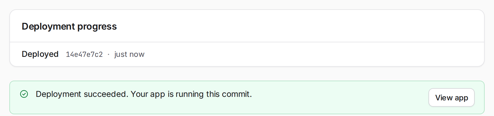
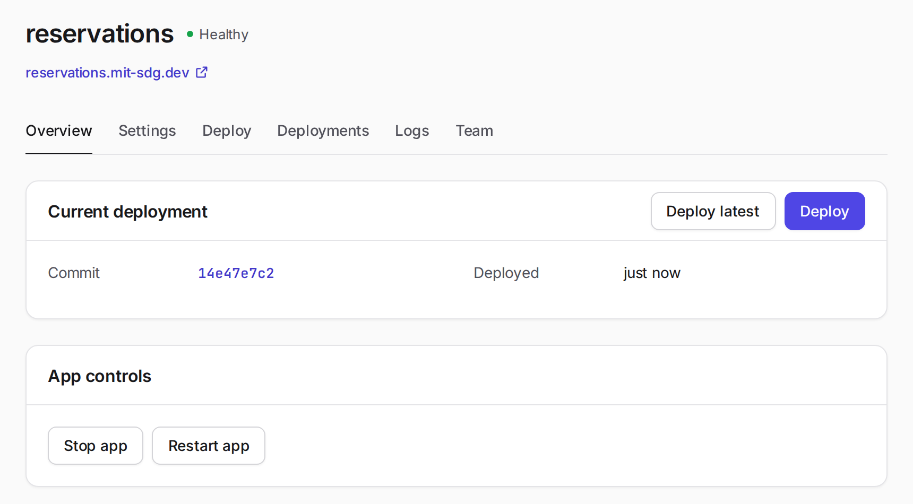
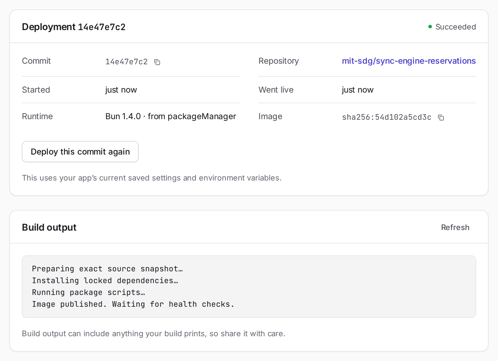

In [Developing a sync-engine app locally](sync-engine-local-dev.md), you ran an app with local commands, then used Compose to run the backend, frontend, and MongoDB in containers. That setup also works on a dedicated server. You copy the code over, run `podman compose up`, and look after the machine yourself.

Lately, more apps run on managed platforms like Cloudflare and AWS. You give the platform your code, and it builds and runs the app, gives it a web address, and restarts it if it crashes. For this class, we have our own platform, 6.1040 Apps, at [mit-sdg.dev](https://mit-sdg.dev).

This guide puts your own app online there. The screenshots use the reservations app from the local guide as a worked example; use your app's repository and settings. Follow the numbered steps in order. The collapsed sections cover optional features and background.

## Before you start

The platform builds from a commit on GitHub. It installs packages from your lockfile, runs your build script if you have one, and makes an image to run. It doesn't use your `Dockerfile` or `compose.yaml`. You enter the settings on the **Settings** tab instead.

Push your code to GitHub, including `bun.lock` for Bun or `package-lock.json` for Node.js. Your repository needs `package.json` at its root, with a script that starts the app and a build script if it needs one. The setup from the local guide already has these.

The server that visitors reach must listen on `PORT` at `0.0.0.0`. The platform sets both `PORT` and `HOST` for you, and only that port is reachable from outside. Your app also needs a health check path, such as `/health`, that returns HTTP 2xx when the app is working.

The platform never sees your `.env`, so you'll enter those settings on the site. Note which variable names your code reads, especially the one for the database.

## 1. Sign in

Open [mit-sdg.dev](https://mit-sdg.dev) and click **Sign in with your class account**. It's the same account you use on Commons. The first time, Commons asks whether `mit-sdg.dev` may see your name, username, and email. Click **Allow**.

<figure class="guide-step guide-step--compact">
  
  <figcaption>Commons remembers your answer until you remove the app in its settings.</figcaption>
</figure>

## 2. Create the app

Click **Create app** and name your app. Any name works if no one has taken it and it follows the rule under the field (3 to 40 lowercase letters, numbers, and single hyphens, starting with a letter).

Choose carefully, because you can't change it later. It becomes part of your app's address: the example named `reservations` gets `https://reservations.mit-sdg.dev`.

<figure class="guide-step guide-step--compact">
  
  <figcaption>The example app is called <code>reservations</code>. Use your own app's name.</figcaption>
</figure>

If you're working in a team, one person creates the app and adds the others on the **Team** tab. Step 6 covers that.

## 3. Fill in the settings

Creating the app opens its **Settings** tab. Fill in the fields for your app.

- **Repository URL**: your repository on GitHub. The screenshot uses `https://github.com/mit-sdg/sync-engine-reservations`. If your repository is private, save the settings first, then open the collapsed section below.
- **Branch**: usually `main`. You'll pick an exact commit from it each time you deploy.
- **Runtime**: **Bun** or **Node.js**, whichever your app uses.
- **Package directories**: leave this as `.`, the repository root.
- **Build script**: the name of your build script, if your app has a build step. The grey `build` in the screenshot is only a placeholder. A Vite frontend still needs its build script here, even on Bun. The reservations app leaves this empty because its Bun server builds the frontend when it starts.
- **Start script**: the name of the script in `package.json` that starts your app, usually `start`. Give the name, not the command. On Bun, the platform runs it as `bun run start`.
- **Port**: the port the server visitors reach listens on. The platform passes this number to your app as `PORT`. The example uses `3000`.
- **Health check path**: your app's health check, such as `/health`.

Click **Save settings**.

<figure class="guide-step">
  
  <figcaption>The reservations app's settings. Its <strong>Build script</strong> field is empty.</figcaption>
</figure>

If your server reads `PORT`, the number you choose doesn't matter, as long as it listens on that port at `0.0.0.0`. For an app with one server serving both pages and API requests, configure that server.

<details>
<summary>If your app has separate frontend and backend servers</summary>

One start script can run both servers. The reservations app uses `bun run --parallel start:backend start:frontend`. Its frontend listens on `PORT` at `0.0.0.0`, while the backend stays on `127.0.0.1:4000`. Visitors reach the frontend, which passes API requests to the backend.

In the local guide, the frontend used port 8080 because `PORT` wasn't set. With the settings above, it uses 3000. The frontend also passes `/health` to the backend, which answers successfully only when it can read MongoDB. That checks the connection through all three parts of the app.

</details>

<details>
<summary>Deploying from a private repository</summary>

For a private repository, the platform needs a deploy key that lets it read that repository. Someone with admin access to the GitHub repository must add the key.

1. Save the repository URL in **Settings**. Under **Private repository**, click **Create deploy key** and copy the key.
2. On GitHub, open the repository's **Settings**, then **Deploy keys**, then **Add deploy key**. Paste the key and leave **Allow write access** off.
3. Return to your app's **Settings** tab and click **Check access**. You should see `GitHub accepts the key.`, followed by the commit your branch is on.

</details>

<details>
<summary>Choosing the Bun or Node.js version</summary>

Your repository can pick the version to build with. The reservations app pins Bun 1.4.0 in `package.json`:

```json
  "packageManager": "bun@1.4.0",
```

`packageManager` needs an exact Bun version. To specify a range, use `engines` instead:

```json
  "engines": { "node": ">=22" }
```

`engines.bun` works the same way. If `package.json` doesn't specify a version, the platform checks `.nvmrc` or `.node-version` for Node.js, or `.bun-version` for Bun. Without any of these, it uses the platform's default.

A range selects the newest release it allows. For Node.js, the platform chooses the newest long-term support (LTS) release in the range, so `>=22` won't select a short-lived odd-numbered release. Node.js versions before 20 and Bun versions before 1.1 aren't supported.

The **Deploy** tab shows which version a commit specifies, and each deployment records the exact version it used.

</details>

## 4. Add a database

If your app uses MongoDB, scroll down to **Databases and storage** on the **Settings** tab, click **Add MongoDB**, and confirm. You can't remove a database yourself later, so only add one your app needs.

<figure class="guide-step">
  
  <figcaption>Add the database or storage your app uses.</figcaption>
</figure>

The next dialog asks which environment variable your app reads for the connection string. It suggests `MONGODB_URI`. Change that if your code uses a different name. For example, the reservations app reads `MONGODB_URL`. Click **Save variables**.

<figure class="guide-step guide-step--compact">
  
  <figcaption>The variable name must match your code. The platform supplies the connection string.</figcaption>
</figure>

Pass that connection string to the MongoDB client unchanged. It already includes the database name and password. The new database is empty; your local MongoDB data stays on your computer.

Add any other settings your app needs, such as API keys, under **Environment variables**. Saved values aren't shown again. Saving a variable restarts the app if it's running.

<details>
<summary>Using PostgreSQL instead</summary>

Click **Add PostgreSQL**. With the suggested variable names, your app gets `DATABASE_URL`, which includes the password, and the standard `PG` variables, such as `PGHOST` and `PGUSER`. Most PostgreSQL clients can connect with `DATABASE_URL` alone.

</details>

## 5. Deploy

Open the **Deploy** tab and pick a commit from your branch, usually the newest. The platform checks that it has `package.json`, the scripts you named, and the lockfile, and shows which Bun or Node.js version it specifies.

<figure class="guide-step">
  
  <figcaption>Check the selected commit and settings before deploying.</figcaption>
</figure>

Click **Review deployment**, check the commit and variables, then click **Deploy**. Progress appears on the **Deploy** tab.

<figure class="guide-step">
  
  <figcaption>On the first deployment, the app stays marked "Not deployed" until it finishes.</figcaption>
</figure>

A deployment can take 10 to 15 minutes. The platform starts new machines to build and run your app, and CSAIL's servers take a while to launch them, so a slow deployment is normal. You can close the page and come back later. The deployment keeps going.

When it finishes, you should see "Deployment succeeded. Your app is running this commit."

<figure class="guide-step">
  
  <figcaption>The selected commit is now running at your app's address.</figcaption>
</figure>

Click **View app** and try it. Test something that saves data: create an item, reload the page, and check that it's still there. If the deployment fails, the **Deploy** tab explains why. Open Troubleshooting at the end of this guide for help.

For later changes, push your code to GitHub, then choose the new commit on the **Deploy** tab. Pushing alone doesn't deploy it. **Deploy latest** on **Overview** is a shortcut to deploy the newest commit on your branch.

## 6. Manage your app

The **Overview** tab shows your app's health and the commit it's running. You can also deploy, stop, or restart it there.

<figure class="guide-step">
  
  <figcaption>"Healthy" means the app is running and its health check passes.</figcaption>
</figure>

Open **Deployments** to see past deployments and their build output. Each one records the commit and the exact Bun or Node.js version used. If a deployment fails, the previous version keeps serving.

If a version deploys successfully but breaks something, open an earlier deployment and click **Deploy this commit again**. This redeploys the old code with your current settings and environment variables. It doesn't restore earlier database contents.

<figure class="guide-step">
  
  <figcaption>The <strong>Runtime</strong> row records the version used and where it was specified.</figcaption>
</figure>

The **Logs** tab shows what the running app prints, with **Output** and **Errors** kept apart, much like `bun run logs` did locally.

<figure class="guide-step">
  
  <figcaption>The example runs both servers, with the frontend on the port visitors reach.</figcaption>
</figure>

On **Team**, the app's owner can add or remove teammates by username. Each teammate must sign in to 6.1040 Apps once before you can add them. Teammates can change settings, deploy, and read logs.

<details>
<summary>Storing files with S3</summary>

Files saved to your app's own disk can disappear on a restart or deployment. Keep data in the database and uploaded files in S3 storage. Under **Databases and storage**, click **Add S3 storage** and keep the suggested variable names.

| Variable | What your app uses it for |
| --- | --- |
| `AWS_ACCESS_KEY_ID`, `AWS_SECRET_ACCESS_KEY` | Credentials. Keep them on the server. |
| `AWS_REGION` | The region. Use the supplied value. |
| `S3_BUCKET` | Your app's bucket. |
| `AWS_ENDPOINT_URL_S3` | The private address for requests from your server. |
| `S3_PUBLIC_ENDPOINT` | The public address for URLs sent to browsers. |

Bun's S3 client reads the credentials, region, and bucket from these variables. Pass in the addresses:

```ts
import { S3Client } from "bun";

// For your server's own reads and writes.
export const s3 = new S3Client({ endpoint: process.env.AWS_ENDPOINT_URL_S3 });

// Only for signing URLs that browsers will use.
export const publicS3 = new S3Client({ endpoint: process.env.S3_PUBLIC_ENDPOINT });
```

Use `s3` on the server to read and write files, as in `await s3.write("notes/hello.txt", "Hello!")` and `await s3.file("notes/hello.txt").text()`.

For a browser upload, your server can make a temporary signed URL. The browser sends the file there without needing your storage credentials:

```ts
// On the server
const key = `uploads/${crypto.randomUUID()}`;
const url = publicS3.presign(key, { method: "PUT", expiresIn: 600 });

// In the browser, with the url from the server
await fetch(url, { method: "PUT", body: file });
```

Save `key` in your database so the app can find the file later. For downloads, use `publicS3.presign(key, { expiresIn: 300 })`.

Check the person's permission to use a file before signing its URL. Anyone with that URL can use it until it expires. Always set `expiresIn`; Bun's default is a whole day. Browser uploads are allowed only from your app's pages, but that restriction doesn't stop someone using a signed URL from another tool. Each upload can be up to 100 MB.

For Node.js, use `@aws-sdk/client-s3` and `@aws-sdk/s3-request-presigner`. They read the same credentials and region variables. Pass in the endpoints and set `forcePathStyle` on the client that signs browser URLs:

```ts
import { S3Client, PutObjectCommand } from "@aws-sdk/client-s3";
import { getSignedUrl } from "@aws-sdk/s3-request-presigner";

const s3 = new S3Client({ endpoint: process.env.AWS_ENDPOINT_URL_S3, forcePathStyle: true });
const publicS3 = new S3Client({ endpoint: process.env.S3_PUBLIC_ENDPOINT, forcePathStyle: true });

const command = new PutObjectCommand({ Bucket: process.env.S3_BUCKET, Key: key });
const url = await getSignedUrl(publicS3, command, { expiresIn: 600 });
```

</details>

<details>
<summary>Letting people sign in with their class account</summary>

Your app can use Commons for sign-in too. It works at `https://<name>.mit-sdg.dev`, and at `http://localhost` on any port during development. Your app handles the exchange below, then starts its own session.

1. Save a random `state` value in an `HttpOnly` cookie, then send the browser to Commons with that value and your app's origin. Replace the example address with your app's address, without a path:

   ```ts
   const origin = "https://reservations.mit-sdg.dev"; // or http://localhost:8080
   const state = crypto.randomUUID();
   const url = new URL("https://class.mit-sdg.dev/connect");
   url.searchParams.set("app", origin);
   url.searchParams.set("state", state);
   ```

   A UUID works as `state`.

2. Commons asks the person to allow your app, then returns them to `<origin>/auth/commons/callback?code=…&state=…`. Your app needs a route at that fixed path. If they cancel, it receives `error=access_denied` instead of a code.
3. In the callback, compare `state` with the cookie and stop if they don't match. From your server, exchange the code for the person's details:

   ```ts
   const response = await fetch("https://class.mit-sdg.dev/api/connect/redeem", {
     method: "POST",
     headers: { "Content-Type": "application/json" },
     body: JSON.stringify({ code, app: origin }),
   });
   // A 400 means the code was used, expired, or issued to another app.
   if (!response.ok) {
     return new Response("Sign-in failed. Try again.", { status: 400 });
   }
   const { user, username, displayName, email } = await response.json();
   ```

4. Start your app's session for `user`, the person's permanent Commons ID.

Each code works once and expires after 60 seconds. Your app never sees the person's password.

</details>

<details>
<summary>How the platform works underneath</summary>

6.1040 Apps runs in a project on CSAIL's OpenStack cloud, which TIG, CSAIL's infrastructure group, runs. OpenStack is open-source software for running your own cloud of virtual machines, much like a private AWS.

Every machine runs NixOS. Its image is built from one commit of the platform repository and boot-tested before use. Machines aren't updated in place; an update replaces the image.

There are five kinds of machines:

- The admin machine runs Nomad, which schedules app containers, and the controller that manages deployments.
- The ingress machine runs Traefik, which routes each app's address to the right app.
- The storage machine runs PostgreSQL, MongoDB, Garage (an S3-compatible file store), and the private registry for app images.
- Each app gets its own worker machine, with no SSH and no persistent disk.
- Each build gets a single-use builder machine.

When you deploy, a fresh builder fetches the exact commit and uses BuildKit to build a container image from the official Node.js or Bun image. It pushes the result to the private registry, then is deleted. The platform starts a fresh worker for your app, and Nomad runs the image there. Traffic switches only after the app, the scheduler, and the public address all pass their health checks. Starting these virtual machines is most of the 10 to 15 minutes. If the new version fails, it's removed and the previous version keeps serving.

Public traffic reaches Cloudflare first, which handles HTTPS. Traefik then forwards it to the app. Databases and S3 files go into encrypted backups every night.

Students don't get SSH, OpenStack, or database-admin access. Secrets and environment values stay on the platform and aren't shown again after saving.

The code is public. You can read the [platform repository](https://github.com/mit-sdg/openstack-deployment-infra) and [Commons](https://github.com/mit-sdg/commons), the class site whose accounts you use to sign in.

</details>

<details>
<summary>Troubleshooting</summary>

For a failed build, open its build output on **Deployments**. If the app built but stopped, click **See why it stopped** on **Deploy**. For an app that runs but behaves incorrectly, check **Logs**. A failed deployment leaves the previous version running, if there is one.

**The Deploy tab says "This commit will fail to build".** Read the reason below it. If the lockfile is missing, run `bun install` or `npm install` locally, commit the lockfile, push, and select the new commit.

**The deployment is still going after 15 minutes.** CSAIL's servers sometimes take longer to launch. Give it more time. If it hasn't finished after half an hour, let the course staff know.

**"Your app started but didn't pass the health check".** Check that the server listens on the **Port** from **Settings**, at `0.0.0.0`, and that the **Health check path** exists and returns HTTP 2xx. If the check reads the database, check that the database variable's name matches your code.

**"Your app exited with code 1".** Click **See why it stopped** and read **Errors** to find what failed.

<figure class="guide-step">
  
  <figcaption>In this example, the backend stopped because <code>MONGODB_URL</code> was missing.</figcaption>
</figure>

The example's error says to add the variable to `.env`, because the same code runs locally. On the platform, check the variable name under **Databases and storage** in **Settings** instead.

**It works locally but fails after deployment.** Check for a setting that only exists in `.env`, an ignored file the app needs, or a commit you haven't pushed. If you used the local guide's setup, try `bun run up`. It runs the app from an image without `.env`, much like the platform does.

**Data or uploaded files disappear after a deployment.** They were saved to the app's own disk. Use the database for data and S3 storage for files.

**Sign-in says "Sign-in was cancelled" or "That sign-in expired".** Click **Sign in with your class account** again. If you clicked **Cancel** on Commons, it asks again next time.

</details>
