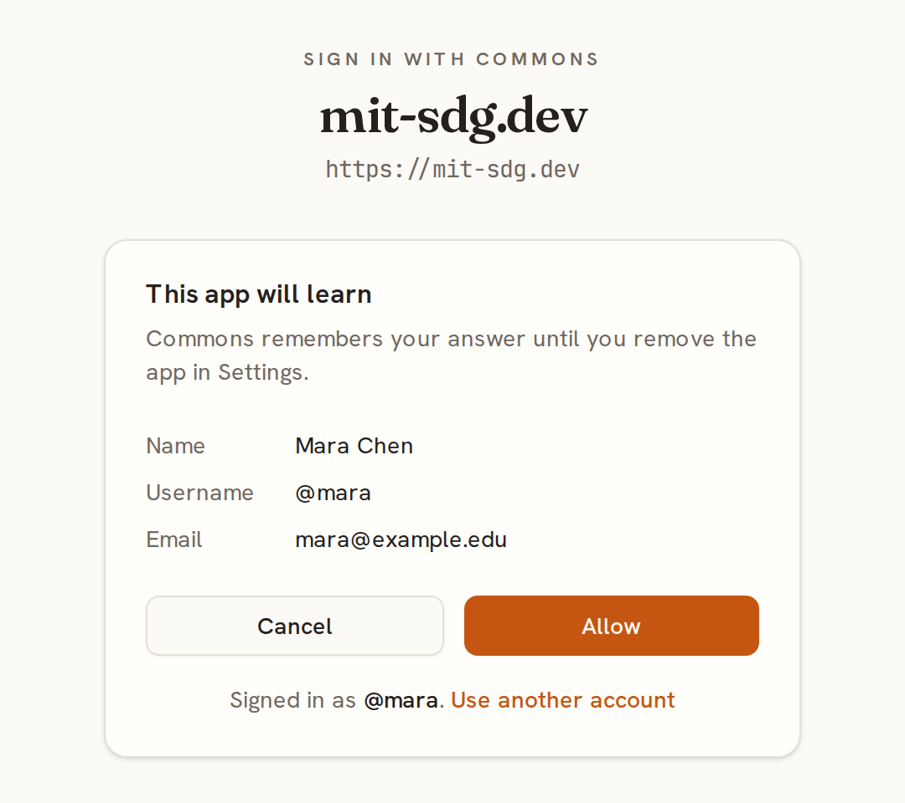
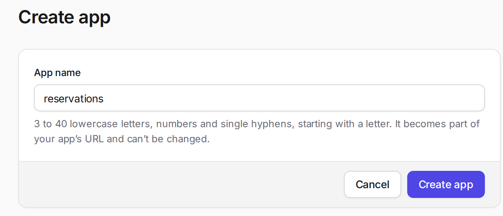
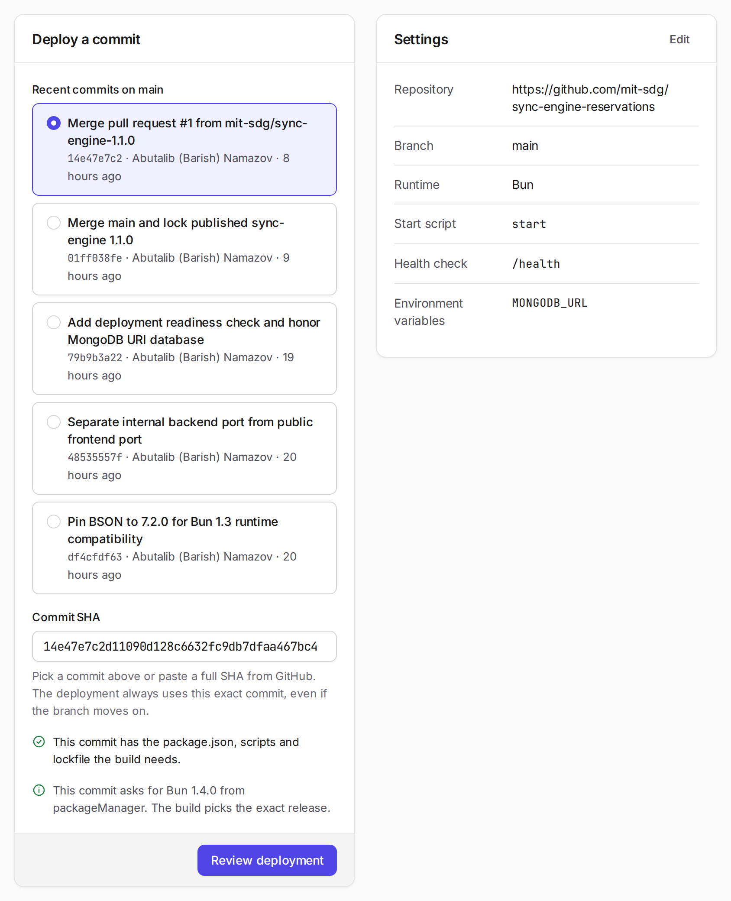
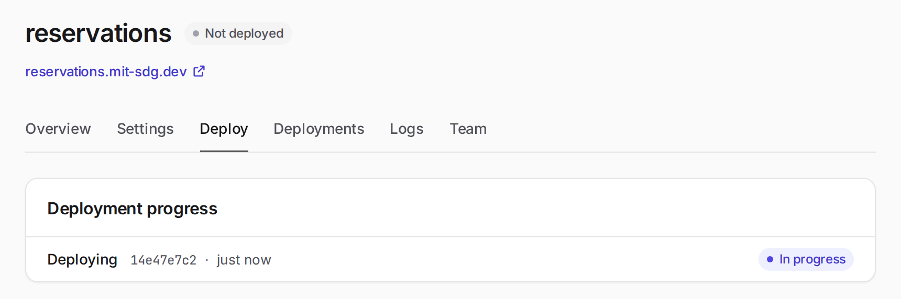
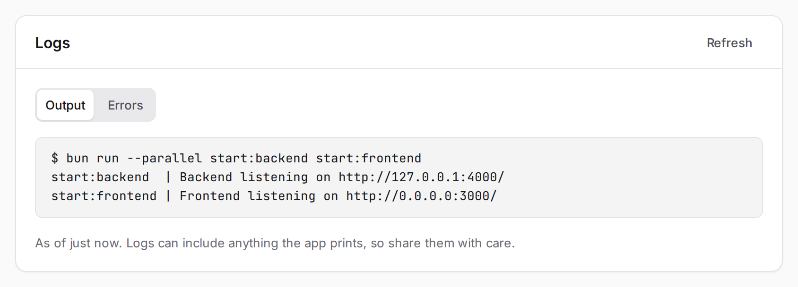
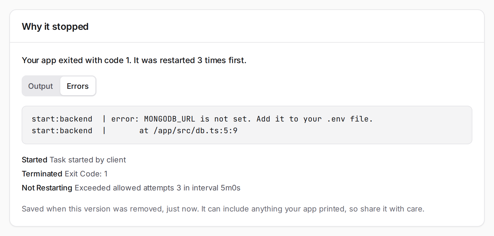

In [Developing a sync-engine app locally](sync-engine-local-dev.md), you ran an app with local commands, and then with Compose, which starts the backend, the frontend, and MongoDB in containers. That's also how you'd run an app on a dedicated server: copy the code over, run `podman compose up`, and look after the machine yourself. Lately, though, more and more apps go to managed platforms like Cloudflare and AWS instead. You give the platform your code, and it builds the app, runs it, gives it a database and a web address, and restarts it if it crashes. The class has its own platform like that, called 6.1040 Apps, at [mit-sdg.dev](https://mit-sdg.dev).

This guide walks you through deploying your own app there. As an example, it uses the reservations app from the local guide, so the screenshots show that app, and each setting mentions the value the reservations app uses. Put in your own app's values instead. Follow the numbered steps in order. The collapsed sections hold extra detail: open them when they apply to you, for example when your repository is private or a deployment fails.

## How the platform runs your app

With Compose, `compose.yaml` described how to run your app. On the platform, you describe it on a website called the portal, and a few things work differently:

- **Your code** comes from a commit on GitHub, not from your computer. The platform installs the packages listed in your lockfile, runs your build script if you have one, and packages the result as an image, a snapshot of your app that's ready to run. It doesn't use a `Dockerfile` or `compose.yaml`.
- **Your app** starts with one script from `package.json`, usually `start`. That script can start more than one server, as the reservations app's does. You choose a port in the portal, the platform passes it to your app in the `PORT` environment variable, and it sends visitors to that port. An environment variable is a setting your app reads when it runs, like the ones in your `.env`. No other port can be reached from outside, so a backend on `127.0.0.1:4000` stays private, just as it did inside a container.
- **Your database** is a MongoDB that the platform creates for your app and backs up every night. Your app finds it through an environment variable.
- **Your settings** stay out of your repository, as before. The platform never sees your `.env`, so you enter those settings in the portal instead.

The platform also needs a **health check**: a path in your app, like `/health`, that answers with a success code (HTTP 2xx) when your app is working. A deployment only succeeds once its health check passes.

## Before you start

Check that your app is ready. If it's set up like the app in the local guide, it already is.

- Your code is pushed to GitHub, including the lockfile: `bun.lock` for Bun, or `package-lock.json` for Node.js.
- `package.json` has a script that starts your app, and a script that builds it if it needs a build step.
- The server that visitors reach listens on the port in `PORT`, at the address `0.0.0.0`. The platform also sets `HOST` to `0.0.0.0`, so reading `PORT` and `HOST` is enough.
- Your app has a health check path.
- You know the names of the environment variables your app reads, like the one for the database's connection string.

## 1. Sign in

Open [mit-sdg.dev](https://mit-sdg.dev) and click **Sign in with your class account**. That's the account you use on Commons. The first time, Commons asks whether the platform, `mit-sdg.dev`, may see your name, username, and email. Click **Allow**.

<figure class="guide-step guide-step--compact">
  
  <figcaption>Commons asks once. After that, signing in takes you straight to your apps.</figcaption>
</figure>

Commons remembers your answer. You can take it back in your Commons settings, and then it asks again the next time you sign in.

## 2. Create the app

Click **Create app** and give your app a name. You can pick any name that fits the form's rule: 3 to 40 lowercase letters, numbers, and single hyphens, starting with a letter. Each name can only be used once on the platform. The name becomes part of your app's address, so an app named `reservations` lives at `https://reservations.mit-sdg.dev`. You can't change it later.

<figure class="guide-step guide-step--compact">
  
  <figcaption>The name is permanent, because it's part of your app's address.</figcaption>
</figure>

If you're working in a team, one of you creates the app and adds the others on its **Team** tab, as step 6 explains.

## 3. Fill in the settings

Creating the app opens its **Settings** tab. Fill in the top section for your app:

- **Repository URL**: your app's repository on GitHub. For the reservations app, that's `https://github.com/mit-sdg/sync-engine-reservations`. The repository needs `package.json` at its root. If it's private, open "Deploying from a private repository" below this list.
- **Branch**: the branch you deploy from, usually `main`. The Deploy tab lists the latest commits on this branch, and you pick the exact commit each time you deploy.
- **Runtime**: **Bun** or **Node.js**, whichever your app uses. The platform installs packages from your lockfile, the file that records the exact version of every package.
- **Package directories**: leave it as `.`, the root of the repository.
- **Build script**: the script that builds your app, if it has a build step. Otherwise, leave it empty. The grey `build` in the screenshot is only a placeholder. Using Bun doesn't remove a frontend build: if your frontend uses Vite, for example, its build script goes here. The reservations app leaves this empty, because its Bun server builds the frontend itself when it starts.
- **Start script**: the script that starts your app, usually `start`. It's the name of a script in `package.json`, not a command, and the platform runs it the way `bun run start` would.
- **Port**: the port your app listens on. The reservations app uses `3000`.
- **Health check path**: your app's health check, like `/health`. It has to answer with HTTP 2xx and a short body, at most 4 KB.

Then click **Save settings**.

<figure class="guide-step">
  
  <figcaption>The settings for the reservations app. The build script is empty.</figcaption>
</figure>

The platform passes the port to your app as `PORT`, so if your app reads `PORT`, the exact number doesn't matter. What matters is that the server visitors reach listens on `PORT` at `0.0.0.0`. If your app has a single server for both the pages and the API, that's the one. The reservations app has two. Its `start` script runs them side by side with `bun run --parallel start:backend start:frontend`. The frontend listens on `PORT` at `0.0.0.0`, and the backend stays on `127.0.0.1:4000`, where only the frontend can reach it. On your computer, the frontend used port 8080 because nothing set `PORT`. Here it uses 3000, the number in Settings.

The frontend also passes `/health` on to the backend, which answers only when it can read MongoDB. So a passing health check shows that the frontend can reach the backend and the backend can reach the database.

<details>
<summary>Deploying from a private repository</summary>

A public repository needs nothing extra. For a private one, the platform needs a deploy key. A deploy key lets the platform read that one repository, and nothing else.

1. In **Settings**, save the repository URL first. Then, under **Private repository**, click **Create deploy key** and copy the key.
2. On GitHub, open the repository's **Settings → Deploy keys → Add deploy key**. Paste the key, and leave **Allow write access** off.
3. Back in the portal, click **Check access**. You should see `GitHub accepts the key.`, followed by the commit your branch is on.

Then continue as usual. Only someone with admin access to the repository on GitHub can add a deploy key, so on a team repository, ask whoever owns it.

</details>

<details>
<summary>Choosing the Bun or Node.js version</summary>

Each build uses the version your repository asks for. The reservations app asks for Bun 1.4.0 with this line in `package.json`:

```json
  "packageManager": "bun@1.4.0",
```

`packageManager` has to name an exact Bun version. To allow a range of versions, use `engines` instead:

```json
  "engines": { "node": ">=22" }
```

`engines.bun` works the same way. If `package.json` doesn't ask for a version, the platform looks for a `.nvmrc` or `.node-version` file for Node.js, or a `.bun-version` file for Bun. If there's none of these, the build uses the platform's default.

A range gets the newest release it allows. For Node.js, that's the newest long-term support (LTS) release, so `>=22` won't land on a short-lived odd-numbered release. Node.js versions before 20 and Bun versions before 1.1 aren't supported.

The Deploy tab shows which version a commit asks for before you deploy it, and each deployment records the exact version it was built with.

</details>

## 4. Add a database

If your app uses MongoDB, scroll down to **Databases and storage** on the same tab and click **Add MongoDB**. Only a platform admin can delete a database, so the portal asks you to confirm.

<figure class="guide-step">
  
  <figcaption>Each app can have its own PostgreSQL, MongoDB, and S3 storage.</figcaption>
</figure>

Next, the portal asks which environment variable should hold the database's connection string. It suggests `MONGODB_URI`. Use the name your code reads. The reservations app reads `MONGODB_URL`, so for it you'd change the name, then click **Save variables**.

<figure class="guide-step guide-step--compact">
  
  <figcaption>You choose the name. The platform fills in the value, which the portal never shows.</figcaption>
</figure>

Your code reads the connection string from that variable, as in `process.env.MONGODB_URL`, and passes it to the MongoDB client unchanged. It already includes the database's name and password. The new database starts empty: the data in your local MongoDB stays on your computer.

If your app reads other settings, like an API key, add them under **Environment variables** on the same tab. You can't see a value again after you save it, and saving one restarts your app if it's running.

<details>
<summary>What the platform sets for you</summary>

Every app gets these environment variables without you adding them:

- `PORT` is the port from your settings.
- `HOST` is `0.0.0.0`, the address a server has to listen on to accept visitors from outside, as in the containers from the local guide.
- `NODE_ENV` is `production`. Bun's frontend server, for example, builds the page once instead of rebuilding it whenever a file changes.
- `PLATFORM_PROJECT_SLUG` is your app's name.
- `NODE_EXTRA_CA_CERTS` lets Node.js and Bun trust the platform's databases and storage. Leave it as it is.

</details>

<details>
<summary>Using PostgreSQL instead</summary>

Click **Add PostgreSQL** instead of **Add MongoDB**. With the suggested names, your app gets `DATABASE_URL`, a connection string that already includes the password, along with the standard `PG` variables, like `PGHOST` and `PGUSER`. Most PostgreSQL clients can connect with `DATABASE_URL` alone.

</details>

## 5. Deploy

Open the **Deploy** tab. It lists the latest commits on your branch, straight from GitHub. Pick the one you want to deploy, usually the newest. The portal checks that commit first: it looks for `package.json`, the scripts you named, and the lockfile, and it notes which Bun or Node.js version the commit asks for.

<figure class="guide-step">
  
  <figcaption>The commit has everything the build needs, and asks for Bun 1.4.0.</figcaption>
</figure>

Click **Review deployment**, check the commit and the variables, and click **Deploy**. The Deploy tab shows the progress.

<figure class="guide-step">
  
  <figcaption>The app says "Not deployed" until its first deployment finishes.</figcaption>
</figure>

**Give it time.** A deployment can take 10 to 15 minutes. The platform runs on CSAIL servers, which can take a while to launch, so a slow deployment is normal and doesn't mean something went wrong. You can close the page and come back later. The deployment keeps going.

When it's done, you should see "Deployment succeeded. Your app is running this commit."

<figure class="guide-step">
  
  <figcaption>Click <strong>View app</strong> to open your app at its address.</figcaption>
</figure>

Click **View app** and try your app the way you did on your computer. A good test is something that saves data: create something, reload the page, and check that it's still there. If the deployment fails instead, the Deploy tab says why, and the Troubleshooting section at the end of this guide covers the usual causes.

Pushing to GitHub doesn't deploy anything by itself. To put a change online, push it, open the Deploy tab, and pick the new commit. **Deploy latest** on the Overview tab is a shortcut that deploys the newest commit on your branch.

## 6. Keep an eye on it

The tabs along the top cover everything after the first deployment. **Overview** shows whether your app is healthy and which commit is running, with buttons to deploy, stop, and restart it.

<figure class="guide-step">
  
  <figcaption>Healthy means your app is running and its health check passes.</figcaption>
</figure>

**Deployments** lists every deployment you've made. Each one shows the commit, the Bun or Node.js version it was built with, and the build output: everything the build printed. If a new version breaks something, open an earlier deployment and click **Deploy this commit again** to go back to it. That changes which code runs, not your data, and it uses your current settings and environment variables.

<figure class="guide-step">
  
  <figcaption>The Runtime row shows the exact version and what asked for it, here the <code>packageManager</code> line.</figcaption>
</figure>

**Logs** shows what your running app prints, with **Output** and **Errors** kept separate. It's the deployed version of what `bun run logs` showed you locally. Build output and logs answer different questions: the build output shows what happened while building, and the logs show what the app does once it runs.

<figure class="guide-step">
  
  <figcaption>The reservations app's backend listens on an internal port, and its frontend on the platform's port.</figcaption>
</figure>

**Team** is where you add teammates, by username. Teammates can change settings, deploy, and read logs. Only you, the app's owner, can add or remove people. A teammate has to sign in to the platform once before you can add them.

<details>
<summary>Storing files with S3</summary>

Anything your app saves to its own disk can disappear when the app restarts or you deploy again. Keep data in the database, and keep files, like uploaded images, in S3 storage. S3 stores files in a bucket, your app's own folder on the storage server. Add **S3 storage** under **Databases and storage** and keep the suggested variable names. Your app gets:

| Variable | What it holds |
| --- | --- |
| `AWS_ACCESS_KEY_ID`, `AWS_SECRET_ACCESS_KEY` | The credentials. Keep them on the server. |
| `AWS_REGION` | The region. Use it as it is. |
| `S3_BUCKET` | Your app's bucket. |
| `AWS_ENDPOINT_URL_S3` | The private address, for your server's own requests. |
| `S3_PUBLIC_ENDPOINT` | The public address, for URLs you give to browsers. |

Bun's S3 client reads the credentials, region, and bucket by itself, but not the two addresses, so pass those in:

```ts
import { S3Client } from "bun";

// For your server's own reads and writes.
export const s3 = new S3Client({ endpoint: process.env.AWS_ENDPOINT_URL_S3 });

// Only for signing URLs that browsers will use.
export const publicS3 = new S3Client({ endpoint: process.env.S3_PUBLIC_ENDPOINT });
```

Your server reads and writes files with `s3`, as in `await s3.write("notes/hello.txt", "Hello!")` and `await s3.file("notes/hello.txt").text()`.

To let a browser upload a file without sending it through your server, use a signed URL: a temporary link that your server makes, which lets the browser upload or download one file without knowing the credentials. Your server makes the URL, and the browser sends the file to it:

```ts
// On the server
const key = `uploads/${crypto.randomUUID()}`;
const url = publicS3.presign(key, { method: "PUT", expiresIn: 600 });

// In the browser, with the url from the server
await fetch(url, { method: "PUT", body: file });
```

Then save `key` in your database, so your app knows which file belongs to what. Downloads work the same way, with `publicS3.presign(key, { expiresIn: 300 })`.

A few rules keep this safe:

- Check that the person may use the file before you sign a URL. Anyone who has a signed URL can use it until it expires, from any tool.
- Always pass `expiresIn`, because Bun's default is a whole day.
- Browsers only allow uploads from your app's own pages, not from other websites. That doesn't protect the files themselves, so the first rule still matters.
- Each upload can be up to 100 MB.

With Node.js, use the AWS SDK (`@aws-sdk/client-s3` and `@aws-sdk/s3-request-presigner`). It reads the credentials and region from the same variables. Pass the endpoints in, and set `forcePathStyle` on the client that signs browser URLs:

```ts
import { S3Client, PutObjectCommand } from "@aws-sdk/client-s3";
import { getSignedUrl } from "@aws-sdk/s3-request-presigner";

const s3 = new S3Client({ endpoint: process.env.AWS_ENDPOINT_URL_S3, forcePathStyle: true });
const publicS3 = new S3Client({ endpoint: process.env.S3_PUBLIC_ENDPOINT, forcePathStyle: true });

const command = new PutObjectCommand({ Bucket: process.env.S3_BUCKET, Key: key });
const url = await getSignedUrl(publicS3, command, { expiresIn: 600 });
```

</details>

<details>
<summary>Letting people sign in with their class account</summary>

Your app can use the same Commons sign-in as the platform. It works for apps at `https://<name>.mit-sdg.dev`, and for `http://localhost` on any port while you develop. Here's how the exchange works. After it, you start a session the way you would for any sign-in.

1. Send the browser to Commons with your app's origin, which is its address without a path, and a random `state` value. Save `state` in an `HttpOnly` cookie first, so you can check it when the person comes back:

   ```ts
   const origin = "https://reservations.mit-sdg.dev"; // or http://localhost:8080 while developing
   const state = crypto.randomUUID();
   const url = `https://class.mit-sdg.dev/connect?app=${encodeURIComponent(origin)}&state=${state}`;
   ```

   `state` can be 16 to 256 letters, digits, `.`, `_`, `~`, and `-`, so a UUID works.

2. Commons asks the person to allow your app, like it did for the platform. Then it sends them back to `<origin>/auth/commons/callback?code=…&state=…`. That path is fixed, so your app needs a route there. If they cancel, the callback gets `error=access_denied` instead of a code.
3. In the callback, check that `state` matches the cookie, and stop if it doesn't. Then, from your server, trade the code for the person's details:

   ```ts
   const response = await fetch("https://class.mit-sdg.dev/api/connect/redeem", {
     method: "POST",
     headers: { "Content-Type": "application/json" },
     body: JSON.stringify({ code, app: origin }),
   });
   // A 400 means the code was used, expired, or issued to another app.
   if (!response.ok) {
     return new Response("Sign-in failed. Try again.", { status: 400 });
   }
   const { user, username, displayName, email } = await response.json();
   ```

4. Start your own session for `user`. It's the person's Commons ID, and it never changes.

A code works once and expires after 60 seconds. Your app never sees the person's password.

</details>

<details>
<summary>Troubleshooting</summary>

When something fails, first find out where. If the build failed, the deployment's build output on the **Deployments** tab shows why. If the app built but then stopped, the Deploy tab links to **See why it stopped**. If the app runs but misbehaves, look at **Logs**.

**The Deploy tab says "This commit will fail to build".** The line under it says why. Most often the lockfile is missing, as in "Commit bun.lock in the repository root." Run `bun install` (or `npm install` for Node.js), commit the lockfile, push, and pick the new commit.

**The deployment is still going after 15 minutes.** The CSAIL servers are sometimes slower than usual, so give it a little longer. If it's still going after half an hour, let the course staff know.

**The deployment failed with "Your app started but didn't pass the health check".** The platform didn't get a success code from your health check path. Check that the port in Settings is the one your app listens on, that the server listens at `0.0.0.0` rather than `127.0.0.1`, and that the health check path exists. If your health check uses the database, like the reservations app's does, also check the database variable's name.

**The deployment failed with "Your app exited with code 1".** Click **See why it stopped**. **Errors** shows what your app printed before it stopped.

<figure class="guide-step">
  
  <figcaption>The app couldn't find <code>MONGODB_URL</code>, so it stopped right away.</figcaption>
</figure>

Here, the message still says to add the variable to `.env`, because that's where it came from locally. On the platform, it means the variable name under **Databases and storage** doesn't match the one your code reads.

**It works on your computer, but not once it's deployed.** Your app probably depends on something that never reached GitHub: a setting in `.env`, a file that git ignores, or a commit you didn't push. Try `bun run up` from the local guide. It runs your app from an image without `.env`, much like the platform does.

**Data or uploaded files disappear after a deployment.** The app saved them to its own disk. Keep data in the database and files in S3 storage.

**Sign-in says "Sign-in was cancelled" or "That sign-in expired".** Click **Sign in with your class account** again. If you clicked **Cancel** on Commons by mistake, it asks again next time.

</details>
